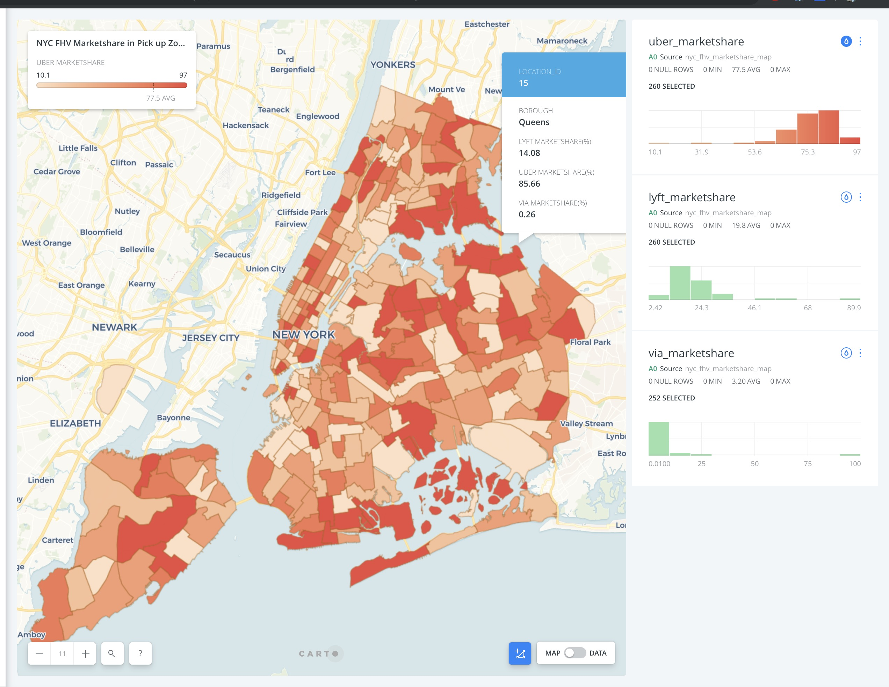

## I. Introduction
This is a comprehensive Exploratory Data Analysis for 300 millions of for-hire vehicle (Uber, Lyft, Via) trips originating in New York City from **2018-01-01** to **2018-12-31**, and we focuse on trip counts and duration in New York competition with tidy R, ggplot2, and plotly.

The goal of this challenge is to process large data sets and to understand the duration of FHV in NYC based on features: trip location, pick-up, drop-off time, and weather effect. Also, we are interested in the difference betweeen three companies such as market shares, targeted customers, and business strategy. First of all, we analysis and visualize the original data, engineer new features, aggregate time-series variables to understand the data and pattern. Second, we compare three companies (Uber, Lyft, Via) over various time frame on trip amount and duration to analyze the market share and business strategy. Lastly, we add external NYC weather data to study how the weather impact on the trip duration and order requests in order to understand users behavior.

## II. Description of the data source
The data were collected and provided to the NYC Taxi and Limousine Commission (TLC) by technology providers authorized under the Taxicab & Livery Passenger Enhancement Programs (https://www1.nyc.gov/site/tlc/about/tlc-trip-record-data.page).

The For-Hire Vehicle ("FHV") trip records since 2009 until present including fields capturing the dispatching base license number and the pick-up date, time, and taxi zone location ID. We are focusing on the time period from **2018-01-01** to **2018-12-31**, so the data comes in the shape of 200+ million observations, and each row contains one trip infomation.

The base license number is matching with different vehicle companies, so that we will join the `base-number` file to define the vehicle types, and we only focus on Uber, Lyft, Via at this point.

The NYC Taxi Zones map provided by TLC and published to NYC Open Data(https://data.cityofnewyork.us/Transportation/NYC-Taxi-Zones/d3c5-ddgc). This map shows the NYC taxi zones corresponding to the pick up zomes and drop off zones, or location IDs, included in the FHV trip records. The taxi zones are roughly based on NYC Department of City Planning's Neighborhood Tabulation Areas (NTAs) and are meant to approximate neighborhoods.

The NYC Weather data is provided by National Centers For Environmental Information (https://www.ncdc.noaa.gov/data-access). NCEI is the world's largest provider of weather and climate data. Land-based, marine, model, radar, weather balloon, satellite, and paleoclimatic are just a few of the types of datasets available. The weather data we are using is collected from NY Central Park Station (USW00094728) from **2018-01-01** to **2018-12-31**, which contains daily weather records such as wind, precipitation, snow and snow depth.

Statistics through December 31, 2018:

* 17.2 GB of raw data
* 300+ million for-hire vehicle total trips
* 365 daily weather records

Existing problem:

* R reads entire data set into RAM all at once. Total 17.2 GB of raw data would not fit in local memory at once.
* R Objects live in memory entirely, which cause slowness for data analysis.
* The TLC publishes base trip record data as submitted by the bases, and we cannot guarantee or confirm their accuracy or completeness.


## III. Description of data import / cleaning / transformation
### 3.1 Libraries and Dependencies
```{r, warning=F, message=F}
library(tibble) # data wrangling
library(reshape2) # data wrangling
library(tidyr) # data wrangling
library(dplyr) # data manipulation
library(purrr) # data manipulation
library(data.table) # data manipulation
library(ggplot2) # visualisation
library(plotly) # visualisation
library(lubridate) # date and time
library(naniar) #missing visualization
```

```{r, echo=F}
setwd("E:/Work/Taxi/Analysis")
```

### 3.2 Data collection
First of all, we write a `shell` script to download original data from public websites
```{r, eval=F}
curl https://s3.amazonaws.com/nyc-tlc/trip+data/fhv_tripdata_2018-01.csv >201801.csv
curl https://s3.amazonaws.com/nyc-tlc/trip+data/fhv_tripdata_2018-02.csv >201802.csv
curl https://s3.amazonaws.com/nyc-tlc/trip+data/fhv_tripdata_2018-03.csv >201803.csv
curl https://s3.amazonaws.com/nyc-tlc/trip+data/fhv_tripdata_2018-04.csv >201804.csv
curl https://s3.amazonaws.com/nyc-tlc/trip+data/fhv_tripdata_2018-05.csv >201805.csv
curl https://s3.amazonaws.com/nyc-tlc/trip+data/fhv_tripdata_2018-06.csv >201806.csv
curl https://s3.amazonaws.com/nyc-tlc/trip+data/fhv_tripdata_2018-07.csv >201807.csv
curl https://s3.amazonaws.com/nyc-tlc/trip+data/fhv_tripdata_2018-08.csv >201808.csv
curl https://s3.amazonaws.com/nyc-tlc/trip+data/fhv_tripdata_2018-09.csv >201809.csv
curl https://s3.amazonaws.com/nyc-tlc/trip+data/fhv_tripdata_2018-10.csv >201810.csv
curl https://s3.amazonaws.com/nyc-tlc/trip+data/fhv_tripdata_2018-11.csv >201811.csv
curl https://s3.amazonaws.com/nyc-tlc/trip+data/fhv_tripdata_2018-12.csv >201812.csv
```

### 3.3 Data Import
Due to local memeory issue and efficiency issue in R, the solution of processing large data is using high-performance version of base R's data.frame `data.table` and randomly sampling 3% of total data.

we use `fread` function to boost data process, select the vehicle company (Uber, Lyft, Via) based on the license number, and store into `data.table` format to perform our structured data. Each row contains trip information such as travel time, pick-up, drop-off date, time, location ID, and vehicle type.

Weather data can be read by local `csv` file, and inner join on trip data by key `date`.

```{r, eval=F}
base = read.csv("../Data/base_number.csv")$x %>% as.character()

weather = read.csv("../Data/weather.csv") %>%
  mutate(date = as.Date(as.character(DATE))) %>%
  select(-STATION, -TAVG, -DATE)

import_data = function(start, end)
{
  data = c()
  for(i in start:end)
  {
    file = paste("../Data/20180", i, ".csv") %>% gsub(" ", "", .)
    
    temp = fread(file) %>% data.table() %>%
      .[Dispatching_base_number %in% c("B02510", "B02800", base)] %>%
      .[, type := ifelse(Dispatching_base_number == "B02510", "Lyft",
                         ifelse(Dispatching_base_number == "B02800", "Via", "Uber"))] %>%
      .[, day := day(pickup_datetime)] %>%
      .[, pick_hour := hour(pickup_datetime)]
    
    temp = temp[, r := row_number(pickup_datetime), by = .(day, pick_hour)][r <= 400]

    data = rbindlist(list(data, temp), use.names = FALSE)
  }
  
  remove(temp)
  
  data = data[weather, on = 'date', nomatch = 0][, r:=NULL]
  fwrite(data, paste("../Data/", start, "-", end, "_weather.csv") %>% gsub(" ", "", .))

  return(data)
}

data = import_data(1,12)
```

### 3.4 Data Processing
Next, we use `lubridate:ymd_hms` and `lubridate:mdy_hms` transformat string to standard time stamp variables, and calucate the travel time in **second** by sbustracting drop-off time and pick-up time.

```{r, eval=F}
data = data %>%
  .[, pickup_datetime := ymd_hms(Pickup_DateTime)] %>%
  .[, dropoff_datetime := ymd_hms(DropOff_datetime)] %>%
  .[, travel_time := as.numeric(dropoff_datetime-pickup_datetime)] %>%
  .[, date := date(pickup_datetime)] %>%
  .[, month := month(pickup_datetime)] %>%
  .[, day := day(pickup_datetime)] %>%
  .[, wkday := weekdays(date)] %>%
  .[, pick_hour := hour(pickup_datetime)] %>%
  .[, pickup_location_id := PUlocationID] %>%
  .[, dropoff_location_id := DOlocationID] %>%
  .[, list(travel_time, pickup_datetime, dropoff_datetime, date, month, day,
           pick_hour, pickup_location_id, dropoff_location_id, type,
           AWND, PRCP, SNOW, SNWD, TMAX, TMIN)]
```

### 3.5 Data Structure Overview
Let's have an overview of the first 10 rows of data.

```{r, echo=F}
# data = read.csv("../Data/1-12_weather_mini.csv") %>% as_tibble() %>%
#   mutate(pickup_datetime = ymd_hms(pickup_datetime),
#          dropoff_datetime = ymd_hms(pickup_datetime),
#          date = date(date))

data = read.csv("../Data/1-12_weather_mini.csv") %>% data.table() %>%
  .[, pickup_datetime := ymd_hms(pickup_datetime)] %>%
  .[, dropoff_datetime := ymd_hms(dropoff_datetime)] %>%
  .[, date := date(date)]

data
```


### 3.6 Data Missing & Outliers
Let's visualize the pattern of missing value in the dataset.

```{r, echo=F, fig.keep='last'}
gg_miss_upset(data)
```

```{r, echo=F}
data[rowSums(is.na(data)) > 0,]
```


Due to FHV companies' policy, the trip is allowed to be cancelled in 2 minutes. In New York City, it's unlikely the travel time is longer than 5 hours.

Following **heat map** shows the percentage of trips are less than 2 minutes and larger than 5 hours for each pick-up and drop-off borough.

```{r, echo=F, fig.width=8, fig.height=4}
pick = read.csv("../Data/dictionary_pickup.csv") %>%
  rename(pickup_location_id = PUlocationID,  pick_borough = borough) %>%
  data.table()

drop = read.csv("../Data/dictionary_dropoff.csv") %>%
  rename(dropoff_location_id = DOlocationID,  drop_borough = borough) %>%
  data.table()

#Match borough to location id
match_zone = function(df,pick,drop)
{
  df = pick[df, on = "pickup_location_id"]
  df = drop[df, on = "dropoff_location_id"]
  df = na.omit(df)
  return(df)
}

trip_less_2_min = data[travel_time < 120] %>%
  match_zone(., pick, drop) %>%
  .[, .N, by = list(pick_borough,drop_borough)]

trip_less_2_min[, frac:= round(N/sum(N),3)]

trip_large_300_min = data[travel_time > 18000] %>%
  match_zone(., pick, drop) %>%
  .[, .N, by = list(pick_borough,drop_borough)]

trip_large_300_min[, frac:= round(N/sum(N),3)]

vals = unique(scales::rescale(trip_less_2_min$frac))
o = order(vals, decreasing = FALSE)
cols = scales::col_numeric("Reds", domain = NULL)(vals)
colz = setNames(data.frame(vals[o], cols[o]), NULL)

#Plot Heatmap for trips whose duration less than 2 mins
plot_ly(data=trip_less_2_min, x=~pick_borough,y=~drop_borough,z=~frac, colorscale = colz, type = "heatmap") %>% layout(title = "Less then 2 mins")

#Plot Heatmap for trips whose duration larger than 4 hours
plot_ly(data=trip_large_300_min, x=~pick_borough,y=~drop_borough,z=~frac, colorscale = colz, type = "heatmap") %>% layout(title = "Larger than 5 hours")
```

We find:
* We found there are 25% missing value in the `AWND` and few in the `pickup_location_id` and `dropoff_location_id`. To conclude accurate analysis, we are going to fill in median of `AWND`,  and remove data if `locationID` is missing
* A lot of trip orders in the same borough are less than 2 minutes duration, which might be correct
* However, it is impossible the trip is crossing two borough taking less than 2 minutes, so we are considered as cancalled orders.


```{r, echo=F}
# replace NA AWND
data[is.na(data[, AWND]), AWND := median(data[, AWND], na.rm = T)]

# remove NA of locationID
data = data[rowSums(is.na(data)) == 0,]

# remove short & large travel time
data = data[travel_time > 120 &  travel_time < 18000]
```

### 3.7 Data Transformation
The density plot shows the duration distribution has a significantly right skew.

```{r, fig.width=8, fig.height=4, results="hide"}
density1 = density(data[,travel_time])
plot_ly(x = ~ density1$x, y = ~ density1$y, type = 'scatter', mode = 'lines', name = 'Fair cut', fill = 'tozeroy') %>%
  layout(title = "Density Plot for Trip Duration",
    xaxis = list(title = 'Duration'),
         yaxis = list(title = 'Density'))
```

We might take **Log** transformation on the duration to solve the skewness issue for furture modeling.
```{r, fig.width=8, fig.height=4}
density1 = density(log(data[, travel_time]))
plot_ly(x = ~ density1$x, y = ~ density1$y, type = 'scatter', mode = 'lines', name = 'Fair cut', fill = 'tozeroy') %>%
  layout(title = "Density Plot for Transformated Travel Time",
    xaxis = list(title = 'Log(Duration)'),
         yaxis = list(title = 'Density'))
```


### 3.8 Data Aggregation
we can aggregate data by different levels in order to calcuate daily hour pick-ups, and median travel time in weekday.

```{r}
data[, .N, by = .(month.abb[month(date)], wkday, pick_hour)]
```


```{r}
data[, .(d.med = median(travel_time)), by = .(wkday, pick_hour)]
```

## V. Results

### 5.1 Overall
First of all, we would likd to view overall median travel time based on hour, weekday and month bases. 
* The median is more robust measurement because it has less effect on outliers.
* Hourly base is showing the peak hour effects in a typical day.
* The weekly base tells the difference between work day and weekends.
* The monthly base has a good explaination on seasonality.

```{r, message=F, warning=F, results="hide", fig.width= 8, fig.height= 4}
p1 = data[, .(d.med = median(travel_time)), by = pick_hour] %>%
  .[order(pick_hour)] %>%
plot_ly(., x = ~ pick_hour, y = ~ d.med, type ="scatter",
        mode = 'lines+markers',
        line = list(color="#2E86C1", width = 4),
        marker = list(size = 8, color = 'rgba(255, 182, 193, .9)', line = list(color = 'rgba(152, 0, 0, .8)', width = 2,simplyfy = F))) %>%
  layout(title = 'Median Travel Time',
         yaxis = list(title = 'Time(sec) (sec)',
                      range=c(800,1200), zeroline = FALSE),
         xaxis = list(title = 'Hour',
                      zeroline = FALSE))

lvl = c("Monday", "Tuesday", "Wednesday", "Thursday", "Friday", "Saturday", "Sunday")

p2 = data[, .(d.med = median(travel_time)), by = sort(ordered(wkday, levels = lvl))] %>%
  plot_ly(., x = ~ sort, y = ~ d.med, type ="scatter",
          mode = 'lines+markers',
          line = list(width=4,simplyfy = F, color='rgb(114, 186, 59)'),
          marker = list(size = 8, color = '#8E44AD', line = list(color = '#3498DB', width = 2))) %>%
  layout(yaxis = list(title = 'Time (sec)', range=c(950,1100),zeroline = FALSE),
         xaxis = list(title = 'Weekday', zeroline = FALSE))

p3 = data[, .(d.med = median(travel_time)), by = sort(ordered(month.abb[month], levels = month.abb))] %>%
  plot_ly(., x = ~ sort, y = ~ d.med, type ="scatter",
          mode = 'lines+markers',
          line=list(color="#FF5733",width = 4),
          marker = list(size = 8, color = '#FFFF00', line = list(color = '#E67E22', width = 2))) %>%
  layout(yaxis = list(title = 'Travel Time',range=c(900,1150), zeroline = FALSE),
         xaxis = list(title = 'Month', zeroline = FALSE))

subplot(p1, p2, p3, nrows = 3)
```
We find:

* The rush hour occurs from 8 AM - 7 PM about 18 minutes, othervise less traffic is after 8 PM
* The highest travel time is 20 minutes at 4 PM, the lowest travel time is 14 minutest at 2 AM (intersting!)
* During weekends, the travel time is higher than weekdays
* For monthly, it shows very strong seasonality that spring and fall have higher travel time; summer and winter are much lower.

### 5.2 Types
We investigate on how the median travel time dependes on the different companies in hourly, weekly and monthly bases.
```{r, echo=F}
accumulate_by = function(dat, var)
{
  var = lazyeval::f_eval(var, dat)
  lvls = plotly:::getLevels(var)
  dats = lapply(seq_along(lvls), function(x) {cbind(dat[var %in% lvls[seq(1, x)], ], frame = lvls[[x]])})
  dplyr::bind_rows(dats)
}
```


```{r, fig.width= 8, fig.height= 4}
data[, .(d.med = median(travel_time)), by = .(pick_hour, type)] %>% 
  .[order(pick_hour, type)] %>%
  as_tibble() %>% accumulate_by(~ pick_hour) %>%
  plot_ly(., x = ~ pick_hour, y = ~ d.med, frame = ~ frame,
          colors=c("hotpink","black","steelblue"),
          color = ~ type, type ="scatter", mode = 'lines+markers',
          line = list(width=4,simplyfy = F), marker = list(size=10),
          text = ~paste("Hour: ", pick_hour, '<br>Average duration:',
                        round(d.med,2))) %>%
  layout(title = 'Hourly Median Travel Time',
         yaxis = list(title = 'Duration (Sec)', zeroline = FALSE),
         xaxis = list(title = 'Hour', zeroline = FALSE)) %>% 
  animation_opts(frame = 300, transition = 200, redraw = F) %>%
  animation_slider(hide = T) %>%
  animation_button(x = 1, xanchor = "right", y = 0, yanchor = "bottom")
```

```{r, fig.width= 8, fig.height= 4}
data[, .N, by = .(pick_hour, type)] %>% 
  .[order(pick_hour, type)] %>%
  dcast(., pick_hour ~ type, value.var = "N" ) %>%
  plot_ly(., x = ~pick_hour, y = ~Uber, type = 'bar', name = 'Uber',
          marker = list(color = 'black')) %>%
  add_trace(y = ~Lyft, name = 'Lyft', marker = list(color = "hotpink")) %>%
  add_trace(y = ~Via, name = 'Via', marker = list(color = "steelblue")) %>%
  layout(yaxis = list(title = 'Counts'), barmode = 'group',
         title = "Hour Trip Counts")
```


```{r, results="hide", fig.width= 8, fig.height= 4,message=F,error=F}
data[, .(d.med = median(travel_time)), by = .(sort(ordered(wkday, levels = lvl)), type)] %>% 
  as_tibble() %>%
  accumulate_by(~ sort) %>%
  arrange(sort) %>%
plot_ly(., x = ~ sort, y = ~ d.med,  colors= c("hotpink","black","steelblue"), color = ~ type,
        type ="scatter", mode = 'lines+markers',line = list(width=4,simplyfy = F), marker = list(size=10),
        text = ~paste("WeekdayHour: ",sort, '<br>Median duration:', round(d.med,2))) %>%
  layout(title = 'Weekday Median Travel Time',
         yaxis = list(title = 'Duration (Sec)',zeroline = FALSE),
         xaxis = list(title = 'Weekday', zeroline = FALSE)) %>%
  animation_opts(frame = 300, transition = 200, redraw = F)
```

```{r, fig.width= 8, fig.height= 4}
data[, .N, by = .(sort(ordered(wkday, levels = lvl)), type)] %>%
  dcast(., sort ~ type, value.var = "N") %>%
  plot_ly(., x = ~sort, y = ~Uber, type = 'bar', name = 'Uber',
          marker = list(color = 'black')) %>%
  add_trace(y = ~Lyft, name = 'Lyft', marker = list(color = "hotpink")) %>%
  add_trace(y = ~Via, name = 'Via', marker = list(color = "steelblue")) %>%
  layout(yaxis = list(title = 'Counts'), barmode = 'group',
         title = "Weekday Trip Counts")
```


```{r, fig.width= 8, fig.height= 4}
data[, .(d.med = median(travel_time)), by = .(month, type)] %>% 
  as_tibble() %>%
  accumulate_by(~ month) %>%
  arrange(month) %>%
  plot_ly(., x = ~ month, y = ~ d.med, colors= c("hotpink","black","steelblue"),
          frame = ~ frame, color = ~ type, type ="scatter", mode = 'lines+markers',
          line = list(width=4,simplyfy = F), marker = list(size=10),
          text = ~paste("Month: ",month, '<br>Median duration:', round(d.med,2))) %>%
  layout(title = 'Monthly Median Travel Time',
         yaxis = list(title = 'Duration (Sec)',zeroline = FALSE),
         xaxis = list(title = 'Month', zeroline = FALSE)) %>% 
  animation_opts(frame = 300, transition = 200, redraw = F) %>%
  animation_slider(hide = T) %>%
  animation_button(x = 1, xanchor = "right", y = 0, yanchor = "bottom")
```

```{r, fig.width= 8, fig.height= 4}
data[, .N, by = .(month, type)] %>%
  dcast(., month ~ type, value.var = "N") %>%
  plot_ly(., x = ~month, y = ~Uber, type = 'bar', name = 'Uber',
          marker = list(color = 'black')) %>%
  add_trace(y = ~Lyft, name = 'Lyft', marker = list(color = "hotpink")) %>%
  add_trace(y = ~Via, name = 'Via', marker = list(color = "steelblue")) %>%
  layout(yaxis = list(title = 'Counts'), barmode = 'group',
         title = "Month Trip Counts")
```

We find:

* For tipical day, Uber, Lyft and Via have simmilar trip duration in each hour 
* For weekly base, Lyft has a litter higher trip duration than others, especially on Monday (interesting!)
* For monthly base, Via is the highest because most trips are share riders, which takes longer time
* Overally, Uber has lowest trip duration comparing other two!

### 5.3 Market Share

We also study the market shares on the both space and time line, so create an interactive map **NYC FHV Marketshare map** to indictate percentage of marketshare for Uber, Lyft and Via at different pick up zone. By simply clicking the map, you can see marketshare data in each zone. The legend lies in the right hand side, where you can also alter different views for each types of taxi by clicking three Teardrop-shaped buttons of applying auto style. (https://zxf71699.carto.com/builder/62d8c815-2839-41fe-95e0-84ac6e4eccb6/embed)



We find:

* Uber has dominant on the FHV market, reaching 75% entire market
* Lyft is second dominant on the FHV market, and weekends have higher numbers of trips.
* Via is a growing company, so it takes a small proportion of market, but it focuses on the peaking hour.

### 5.4 Weather Effect

We have encouraged to supplement our analysis with combining the extural NYC weather data to study how weather is impacted on the trip duration. Of particular interest here will be the rain, snow fall, and sun statistics.

```{r, fig.width=8, fig.height=4}
df_rain = data[(PRCP > 0) & (SNOW == 0), travel_time]
df_snow_rain = data[(PRCP > 0) & (SNOW > 0), travel_time]
df_sunny = data[(PRCP == 0) & (SNOW == 0), travel_time]
df_snow = data[(SNWD > 0), travel_time]

plot_ly(type = 'box') %>%
  add_boxplot(x = df_rain, name = "Rainy Days", fillcolor = 'rgba(254,231,37,0.4)',
              marker = list(color = 'rgba(219, 64, 82, 1.0)'),
              line = list(color = 'rgba(253,231,37,100)')) %>%
  add_boxplot(x = df_snow_rain, name = "Snowy and Rainy Days",fillcolor = 'rgba(93,200,99,0.4)',
              marker = list(color = 'rgba(219, 64, 82, 1.0)'),
                            line = list(color = 'rgba(93,200,99,100)')) %>%
  add_boxplot(x = df_sunny, name = "Sunny Days", fillcolor = 'rgba(33,144,140,0.4)',
              marker = list(color = 'rgba(219, 64, 82, 1.0)'),
              line = list(color = 'rgba(33,144,140,100)')) %>%
  add_boxplot(x = df_snow, name = "Snowy Days", fillcolor = 'rgba(59,82,39,0.4)',
              marker = list(color = 'rgba(219, 64, 82, 1.0)'),
              line = list(color = 'rgba(59,82,39,100)')) %>%
  layout(title = "Weather Effects on Travel Time", hovermode = 'compare',
          yaxis = list(title = '', zeroline =T, showgrid = T),
          xaxis = list(title = 'Duration (Sec)', zeroline = T, showgrid = T))
```


```{r, fig.width=8, fig.height=4, results="hide", warning=F, warning=F,error=F}
plot_ly(type = 'bar') %>%
  add_bars(x = length(df_rain), y= "Rainy Days",name = "Rainy Days", fillcolor = 'rgba(254,231,37,0.4)',
           marker = list(color = 'rgba(254,231,37,0.4)'),
           line = list(color = 'rgba(253,231,37,100)'),
           text = ~paste("weather:","Rainy Days","<br>Trip counts:",length(df_rain))) %>%
  add_bars(x = length(df_snow_rain),   y= "Snowy and Rainy Days",
           name = "Snowy and Rainy Days", fillcolor ='rgba(93,200,99,0.4)',
           marker = list(color = 'rgba(93,200,99,0.4)'),
           line = list(color = 'rgba(93,200,99,100)'),
           text = ~ paste("weather:","Snowy and Rainy Days","<br>Trip counts:",length(df_snow_rain)))%>%
  add_bars(x = length(df_sunny), y = "Sunny Days", name = "Sunny Days", fillcolor = 'rgba(33,144,140,0.4)',
           marker = list(color = 'rgba(33,144,140,0.4)'),
           line = list(color = 'rgba(33,144,140,100)'), 
           text = ~paste("weather:","Sunny Days","<br>Trip counts:",length(df_sunny))) %>%
  add_bars(x = length(df_snow), y= "Snowy Days",name = "Snowy Days", fillcolor = 'rgba(59,82,39,0.4)',
              marker = list(color = 'rgba(59,82,39,0.4)'),
              line = list(color = 'rgba(59,82,39,100)'),
           text = ~paste("weather:","Snowy Days","<br>Trip counts:",length(df_snow))) %>%
  layout(title = "Weather Effect on Trip Counts",
          yaxis = list(TITLE="Weather", zeroline = FALSE, showgrid = T),
          xaxis = list(title = 'Trip Counts', zeroline = F, showgrid = T))
```

We find:

* For sunny days, there are the largest amount of trip requests. It tells most people prefer to hand out.
* Rain causes the larger amount order requests and longer trip duration 
* For snowy days, there are a few outliers, so it might tells more likely occurs extremely cases in the bad weather.
* It seems more like snow would lead to shorter trips, so it could simply mean passengers were more likely to travel shorter distances, or stay at home.